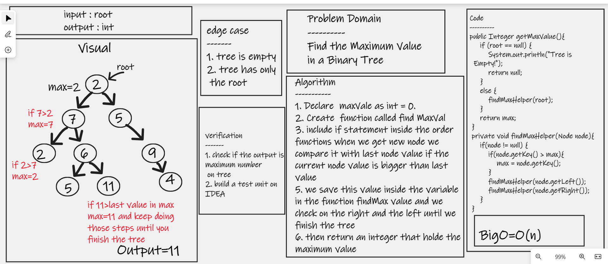

# Challenge Summary
## Find the Maximum Value in a Binary Tree

## Whiteboard Process

## Approach & Efficiency
* Declare  maxVale as int = 0. 
* Create  function called find MaxVal
* include if statement inside the order functions when we get new node we compare it with last node value if the current node value is bigger than last value 
* we save this value inside the variable in the function findMax value and we check on the right and the left until we finish the tree 
* then return an integer that holde the maximum value

## Solution
[GO to my Code](https://github.com/hashem98/data-structures-and-algorithms/blob/main/Java/BinaryTree/app/src/main/java/BinaryTree/BinaryTree.java)
