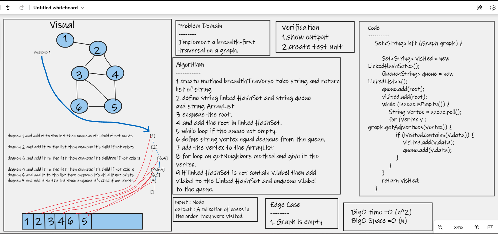

# Challenge Summary
>> write the Breadth-First-Traversal method on Graph.
## Whiteboard Process

## Approach & Efficiency
>> Add a breadth-first method to your graph object that receives a beginning node. Return a collection of nodes in the order they were visited without using any of your built-in functions. 

### Efficiency
>> breadthTraverse: Time: O(n^2) worst case where n is the number of nodes in the graph of a Complete Graphs , Space: O(n) n is the number of nodes
 
## Solution
  # [My Code](https://github.com/hashem98/data-structures-and-algorithms/tree/main/Java/Graphs/lib/src)