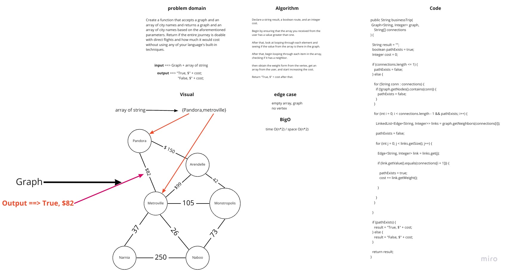

# Challenge Summary
>> Create a function that accepts a graph and an array of city names and returns a graph and an array of city names based on the aforementioned parameters. Return if the entire journey is doable with direct flights and how much it would cost without using any of your language's built-in techniques.

## Whiteboard Process

## Approach & Efficiency
* Time: O(n * m): where n is the cities in the itinerary and m is the available paths in that city
* Space: O(1)

 
## Solution
  # [My Code](https://github.com/hashem98/data-structures-and-algorithms/tree/main/Java/Graphs/lib/src)