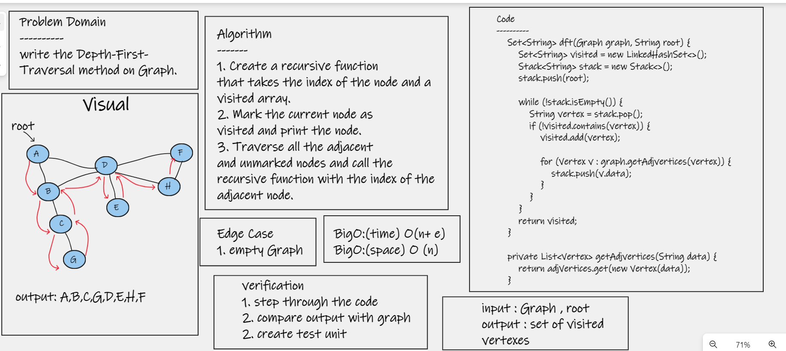

# Challenge Summary
>> write the Depth-First-Traversal method on Graph.

## Whiteboard Process

## Approach & Efficiency
>> The algorithm starts at the root node (selecting some arbitrary node as the root node in the case of a graph) and explores as far as possible along each branch before backtracking. So the basic idea is to start from the root or any arbitrary node and mark the node and move to the adjacent unmarked node and continue this loop until there is no unmarked adjacent node. Then backtrack and check for other unmarked nodes and traverse them. Finally, print the nodes in the path

* Efficiency Time complexity: O(n+ e), where n is the number of vertices and e is the number of edges in the graph. Space Complexity: O(n). Since an extra visited array is needed of size n.

 
## Solution
  # [My Code](https://github.com/hashem98/data-structures-and-algorithms/tree/main/Java/Graphs/lib/src)