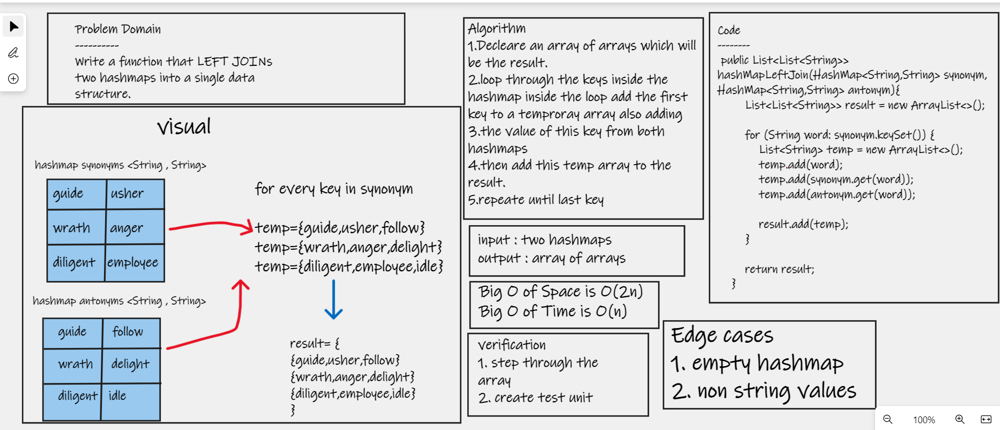

# Hashmap LEFT JOIN
>> Write a function that LEFT JOINs two hashmaps into a single data structure.

## Challenge
>> We have a set of words need to put each word's synonym and antonyms in one array using hashmap

## Whiteboard Process

## Approach & Efficiency
>> write a method that accepts 2 hash maps as a parameter Declare a list and iterate through each hashmap and compare the keys if it matches. If each hash map has the same key, then add the key and values to the list, if not add the second hash map value which is null.

## Solution
   # [My Code](https://github.com/hashem98/data-structures-and-algorithms/tree/main/Java/HashTable/lib/src/main)

