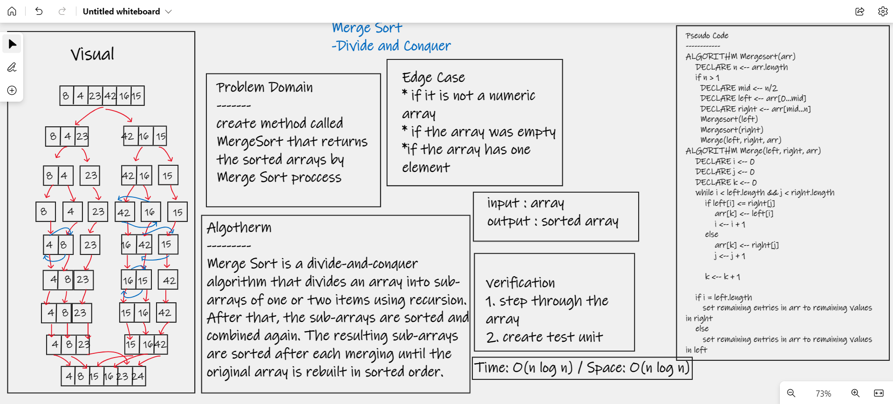

# Merge Sort
## Sorting an array by dividing it in half numerous times until it is sorted and mergeable, and then merging it.

# Challenge
## create method called mergeSort that returns the sorted arrays

# White bord

# [Code](./app/src)

# [Blog](blog27.md)