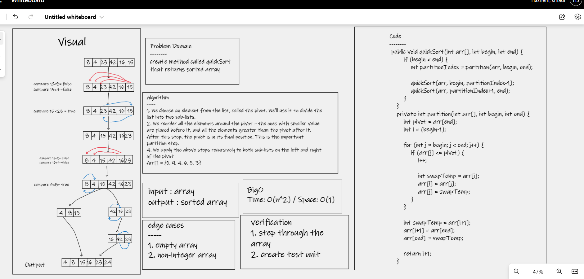

Documentation: Your README.md
# Challenge Summary
>> create method called quickSort to  sorte array

## Whiteboard Process

## Approach & Efficiency
* Let's suppose we pick 5 as the pivot for simplicity
* We'll first put all elements less than 5 in the first position of the array: {3, 4, 5, 6, 5, 9}
* We'll then repeat it for the left sub-array {3,4}, taking 3 as the pivot
* There are no elements less than 3
* We apply quicksort on the sub-array in the right of the pivot, i.e {4}
* This sub-array consists of only one sorted element
* We continue with the right part of the original array, {6, 5, 9} until we get the final ordered array

## Solution
# [Code](https://github.com/hashem98/data-structures-and-algorithms/tree/main/Java/Sort/app/src)

# [Blog](blog28.md)
