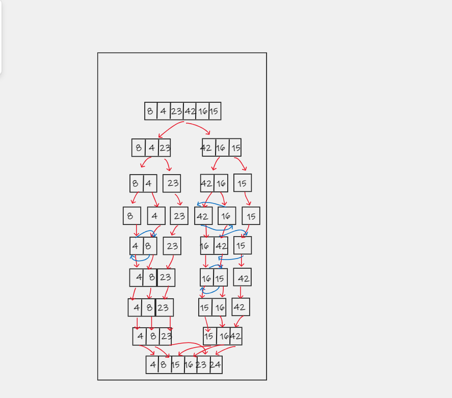

# Merge Sort

## Sorting an array by dividing it in half numerous times until it is sorted and mergeable, and then merging it.

# Pseudocode

```
ALGORITHM Mergesort(arr)
    DECLARE n <-- arr.length

    if n > 1
      DECLARE mid <-- n/2
      DECLARE left <-- arr[0...mid]
      DECLARE right <-- arr[mid...n]
      // sort the left side
      Mergesort(left)
      // sort the right side
      Mergesort(right)
      // merge the sorted left and right sides together
      Merge(left, right, arr)

ALGORITHM Merge(left, right, arr)
    DECLARE i <-- 0
    DECLARE j <-- 0
    DECLARE k <-- 0

    while i < left.length && j < right.length
        if left[i] <= right[j]
            arr[k] <-- left[i]
            i <-- i + 1
        else
            arr[k] <-- right[j]
            j <-- j + 1

        k <-- k + 1

    if i = left.length
       set remaining entries in arr to remaining values in right
    else
       set remaining entries in arr to remaining values in left
```
<br><br><br>

# implementation

>> For the implementation, we'll write a mergeSort function which takes in the input array and its length as the parameters. This will be a recursive function so we need the base and the recursive conditions. The base condition checks if the array length is 1 and it will just return. For the rest of the cases, the recursive call will be executed. For the recursive case, we get the middle index and create two temporary arrays l[] and r[]. The mergeSort function is then called recursively for both the sub-arrays
We then call the merge function which takes in the input and both the sub-arrays and the starting and end indices of both the sub arrays. The merge function compares the elements of both sub-arrays one by one and places the smaller element into the input array. When we reach the end of one of the sub-arrays, the rest of the elements from the other array are copied into the input array thereby giving us the final sorted array


# Trace
 ``Sample Array: [8,4,23,42,16,15]``
 


  <br><br><br>
 * Pass 1
    * First will pass through the array, and then split the array in two.
 * Pass 2
    * The array is split into two seperate arrays.
 * Pass 3
    * The two arrays will split again.
 * Pass 4
    * The left side will be sorted.
 * Pass 5
    * The right side will be sorted
 * Pass 6
    * Both sides will merge once the sorting is done.
 * Pass 7
    * Final iteration will the finished merged array.
  


----

# Time and Space Complexity
``T(n) = 2T(n/2) + O(n)``
### 2T(n/2) corresponds to the time required to sort the sub-arrays and O(n) time to merge the entire array.

### When solved, the time complexity will come to O(nLogn).

### This is true for the worst, average and best case since it will always divide the array into two and then merge.

### The space complexity of the algorithm is O(n) as we're creating temporary arrays in every recursive call


