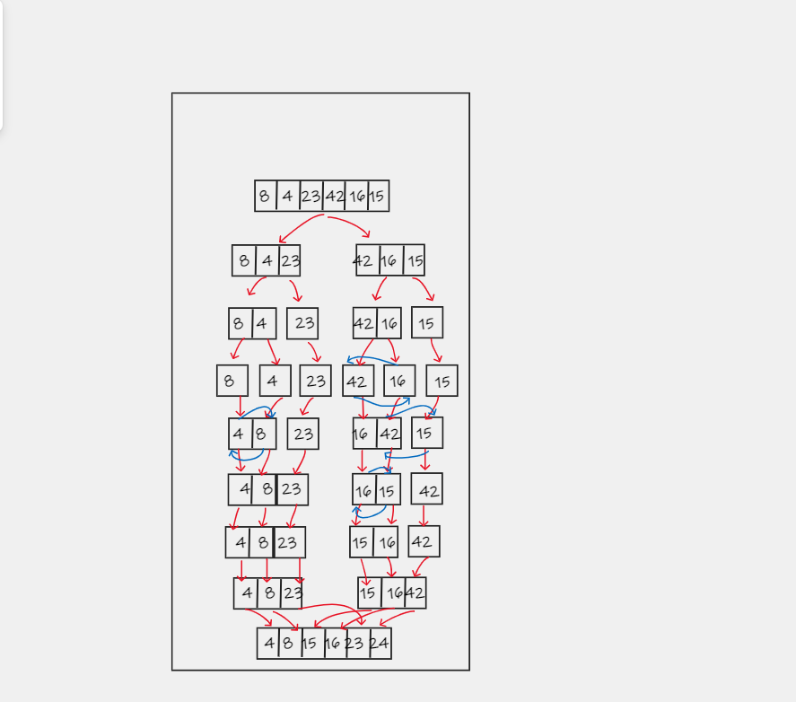

# Quick Sort


## Quick Sort is a sorting algorithm that divides an array into divisions in a recursive manner based on the outcome of sorting the current partition by a pivot point. The array is partitioned and sorted until it is in sorted order throughout.

# Pseudocode

```
ALGORITHM QuickSort(arr, left, right)
    if left < right
        // Partition the array by setting the position of the pivot value 
        DEFINE position <-- Partition(arr, left, right)
        // Sort the left
        QuickSort(arr, left, position - 1)
        // Sort the right
        QuickSort(arr, position + 1, right)

ALGORITHM Partition(arr, left, right)
    // set a pivot value as a point of reference
    DEFINE pivot <-- arr[right]
    // create a variable to track the largest index of numbers lower than the defined pivot
    DEFINE low <-- left - 1
    for i <- left to right do
        if arr[i] <= pivot
            low++
            Swap(arr, i, low)

     // place the value of the pivot location in the middle.
     // all numbers smaller than the pivot are on the left, larger on the right. 
     Swap(arr, right, low + 1)
    // return the pivot index point
     return low + 1

ALGORITHM Swap(arr, i, low)
    DEFINE temp;
    temp <-- arr[i]
    arr[i] <-- arr[low]
    arr[low] <-- temp

```
<br><br><br>

# implementation

>> The first method is quickSort() which takes as parameters the array to be sorted, the first and the last index. First, we check the indices and continue only if there are still elements to be sorted.
We get the index of the sorted pivot and use it to recursively call partition() method with the same parameters as the quickSort() method, but with different indices
the partition() method takes the last element as the pivot. Then, checks each element and swaps it before the pivot if its value is smaller.
By the end of the partitioning, all elements less then the pivot are on the left of it and all elements greater then the pivot are on the right of it. The pivot is at its final sorted position and the function returns this position


# Trace
 ``Sample Array: [8,4,23,42,16,15]``
 


  <br><br><br>
 * Pass 1
    * To begin, we define the position as the result of a call to partition on the whole array, with the pivot value set to 15.
 * Pass 2
    * Because 8 and 4 are the only numbers smaller than 15, they are "usefully" exchanged.
 * Pass 3
    * The number 15 is replaced with the number 23, resulting in a partition index of two. The section of the array to the left of the partition (15) is then quicksorted, with 4 as the pivot value. There are no swaps since 8 is not smaller than 4. The number 4 is replaced with the number 8, resulting in a partition index of 0.
 * Pass 4
    * Then, using 0 as the left value and -1 as the right value, we call quicksort. Nothing is done since 0 is not less than left (0).
 * Pass 5
    * Then, with 1 as the left and right values, we call quicksort. Nothing is done since 1 is not smaller than 1.
 * Pass 6
    * The section of the array to the right of the partition (15) is then quicksorted, with 23 as the pivot value. There is no swap because 42 is more than 23. Because 16 is less than 23, it is replaced with the low index of 3. The partition index of 4 is defined by swapping 23 with 42. Then, using 3 as the left and right values, we call quicksort. Nothing is done since 3 is not less than 3. Then, with 5 as the left and right values, we call quicksort. Nothing is done because 5 is not less than We've completed the right half of 15!
 * Pass 7
    * Sorted Array: [4, 8, 15, 16, 23, 42]


  


----

# Time and Space Complexity
``Time: O(n^2) / Space: O(1)``
>> In the best case, the algorithm will divide the list into two equal size sub-lists. So, the first iteration of the full n-sized list needs O(n). Sorting the remaining two sub-lists with n/2 elements takes 2*O(n/2) each. As a result, the QuickSort algorithm has the complexity of O(n log n) In the worst case, the algorithm will select only one element in each iteration, so O(n) + O(n-1) + … + O(1), which is equal to O(n2).


