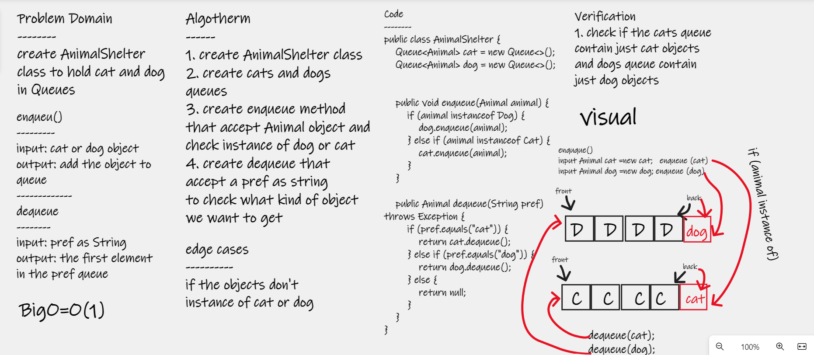

# Challenge Summary
create AnimalShelter class for dog and cat Queue they accept cat and dog objects

## Whiteboard Process

## Approach & Efficiency
The shelter using a FIFO principle and Implement enqueue(animal add animal to the shelter animal can be just dog or cat object. dequeue(pref) which returns dog or a cat, If pref is not "dog" or "cat" then return Exception.

## Solution
# [go to my code](../stackandQueue/app/src/main/java/stackandQueue/AnimalShelter)
