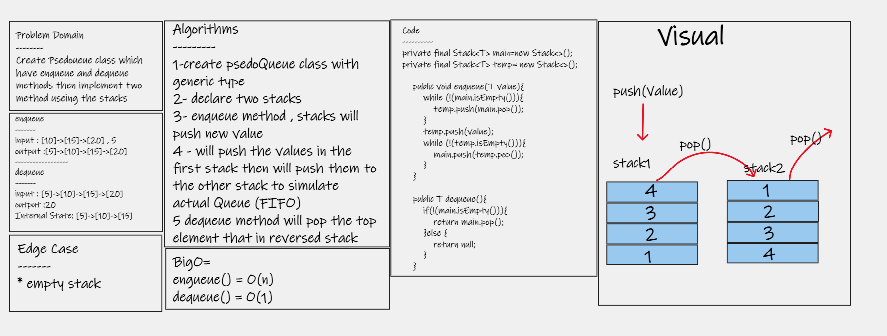

# Challenge Summary
## Implement a Queue using two Stacks.

## Whiteboard Process

## Approach & Efficiency
* enqueue, push value to stack1 then repush to the stack2 to reverse values

* dequeue, the stack must be reversed,so a second stack is used to do this. Once the stack is reversed, the top item is popped, then returning the item

## Solution
### My Code in **PseudoQueue** class and you can see the results in test unit
# [go to my code](https://github.com/hashem98/data-structures-and-algorithms/tree/main/Java/StackandQueue)
