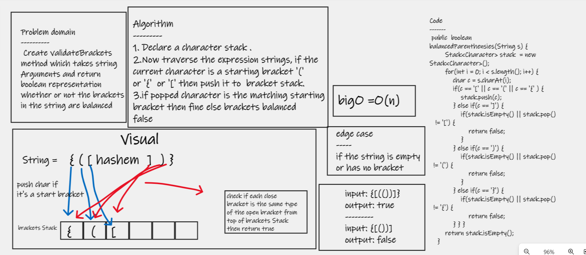

# Challenge Summary
 ## Create validateBrackets method which takes string Arguments and return boolean representation whether or not the brackets in the string are balanced

## Whiteboard Process

## Approach & Efficiency
>> balancedParenthensies(input) this method should take an input as a string.. and check if this string with different type of brackets is balanced or not. which Balanced mean each open bracket must has same close bracket which we initialize stack to hold all input then it will check if the left bracket input equal to the three type of brackets [,{,( , then push them if i have the right side i will check if the stack have the left side by pop if not return false

## Solution

# [go to my code](https://github.com/hashem98/data-structures-and-algorithms/tree/main/Java/StackandQueue)
