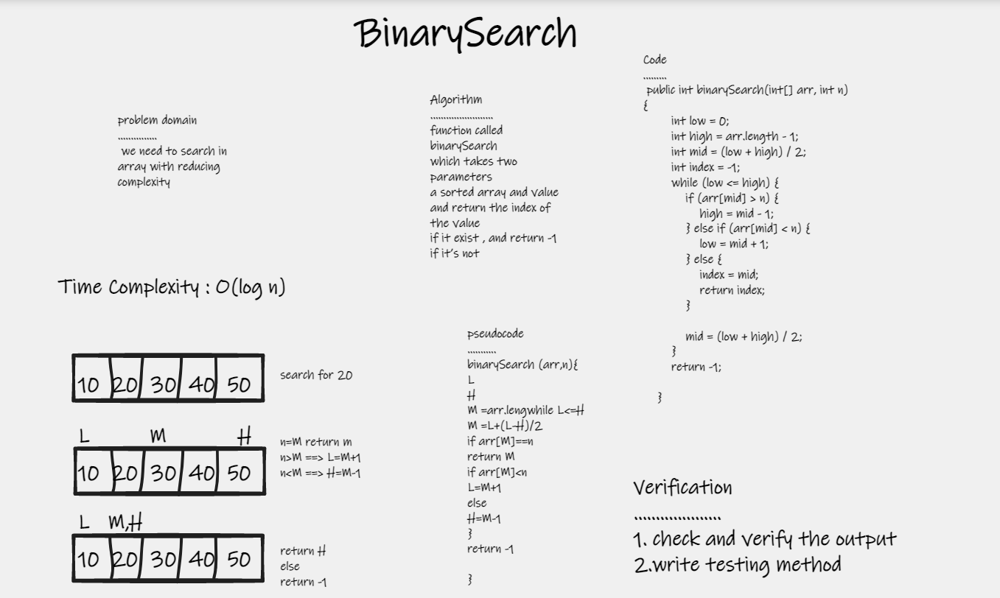

# Binary Search of Sorted Array
## The binarySearch() method takes two parameters : a sorted array and value and return the index of the value if it exist , and return -1 if it’s not 

---

## Whiteboard Process

---
## Approach & Efficiency
### I divided the array by two and looked for the value on the right if it was greater than the middle and on the left if it was less
``Time Complexity : O(log n)``

