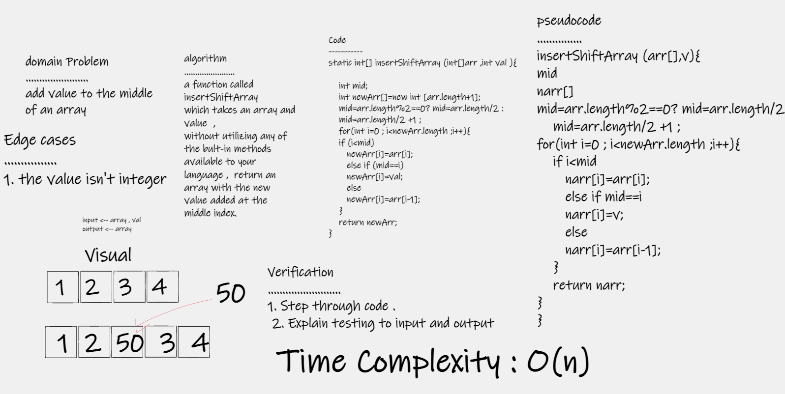

# Insert to Middle of an Array
## The insertShiftArray() method reverses an array and value. and put the value to Middle of an Array
---

## Whiteboard Process

---
## Approach & Efficiency
### I devied the length of array in vareable by ``tow`` and puted the value in that index
``Time Complexity : O(n)``

