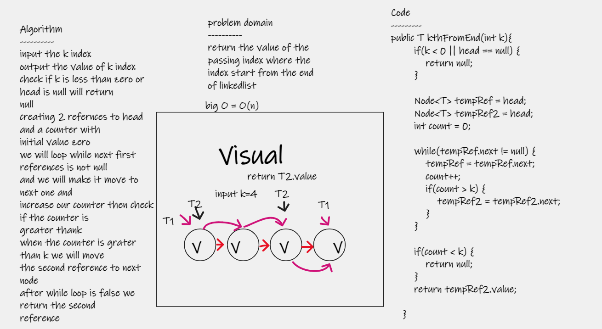

# Challenge Summary
## Linked List kth
### create Linked list and get the value where places in k index from the tail of the linked list.

---

## Whiteboard Process

---
## Approach & Efficiency
### the kth method will initialize two pointer in head the second one will move forward until k-1, and then both of them will move forward one step until second one reach to end of list ; here the position of first one will be the value

---

## Solution
# [Link to my code ](https://github.com/hashem98/data-structures-and-algorithms/tree/main/Java/linkedlist)