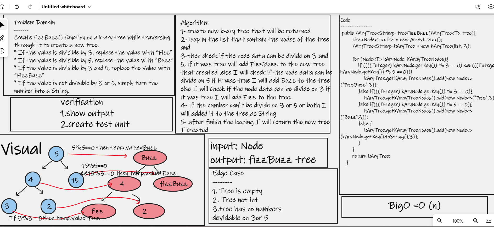

# Challenge Summary
 ## method to replace the integer tree to fizzbuzz tree

#  Whiteboard Process

## Approach & Efficiency
### The method is built to input integer tree and for each value will check if it divisible by 15 it will replace the value with "fizzbuzz" ,if it is divisible by 5 replace the value with "buzz".if it is divisible by 3 replace the value with "fizz"

## Solution
#[Test my Code ](https://github.com/hashem98/data-structures-and-algorithms/blob/main/Java/tree-fizz-buzz/app/src/test)